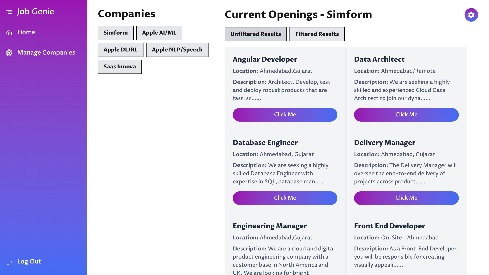
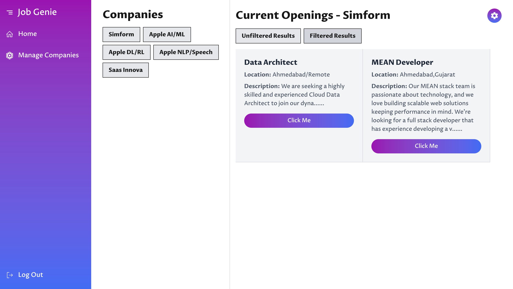
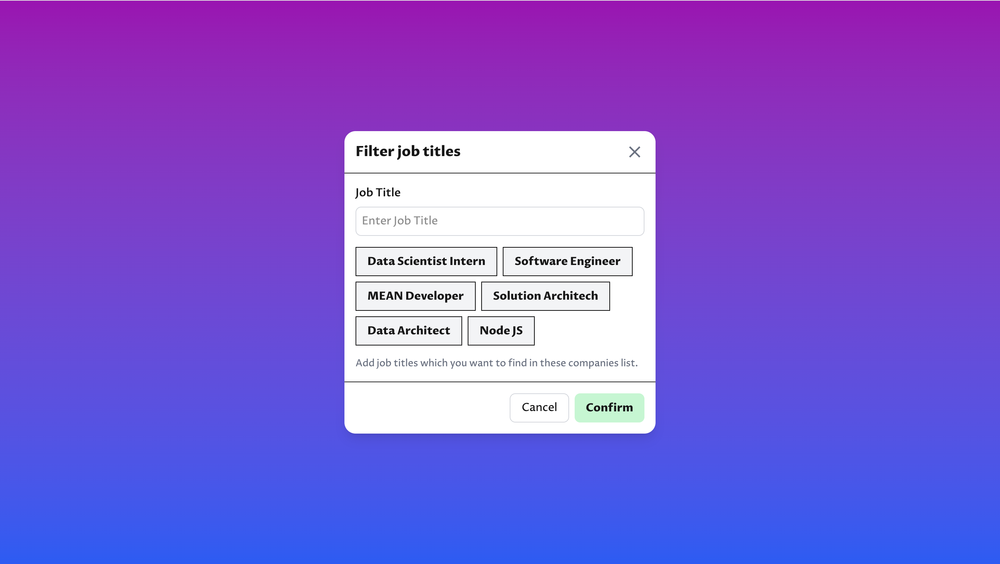
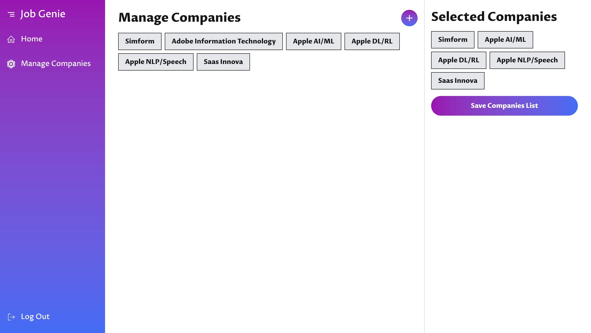
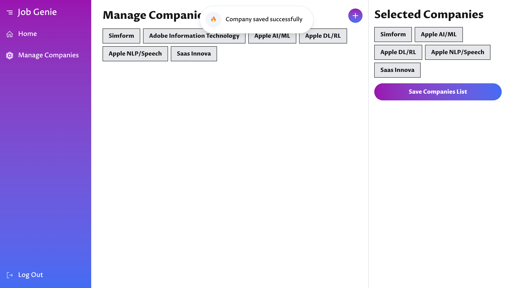
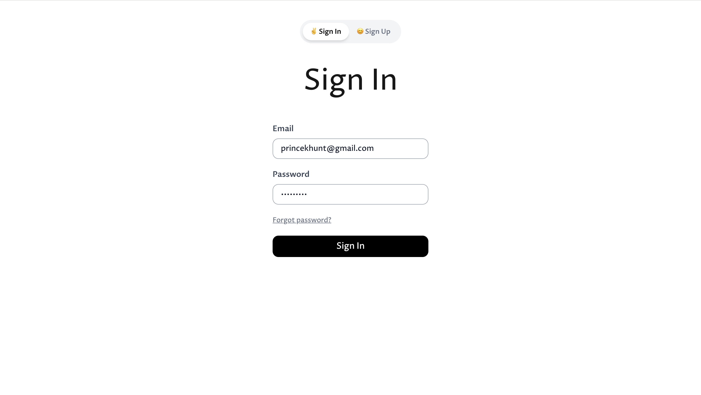
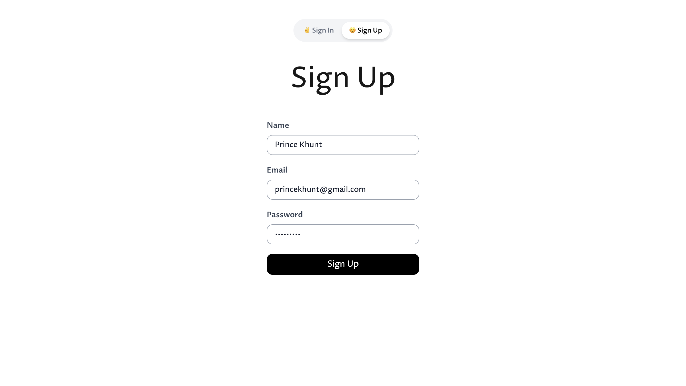

# 🚀 Job Genie - One Click Job Search Tool

**Job Genie** uses an intelligent job search agent powered by **CrewAI** to automate the process of finding job listings on company career pages. The main motive of Job Genie is to save time to check the job listings of companies.

### 🌟 How It Works
- Users select the **URL of the company** they are interested in.  
- They specify a **list of job roles** they want to search for.  
- The agent crawls the page, **extracts relevant job details**, and matches them with the user's preferences.  
- The results are returned via a **FastAPI endpoint**, making it easy to quickly discover and apply for relevant job openings.  

---

## 🛠️ Features
- 🔍 **Automated Job Search:** No need to manually search company career pages.  
- ⚙️ **CrewAI Agent:** Efficiently extracts and filters job listings.  
- 🚀 **FastAPI Endpoint:** Access job results through a fast and reliable API.  
- 🔥 **Customizable Search:** Choose specific companies and job roles.  

---

## 📸 Screenshots  
Here are some screenshots showcasing **Job Genie** in action:

  
  
  
  
  
  
  